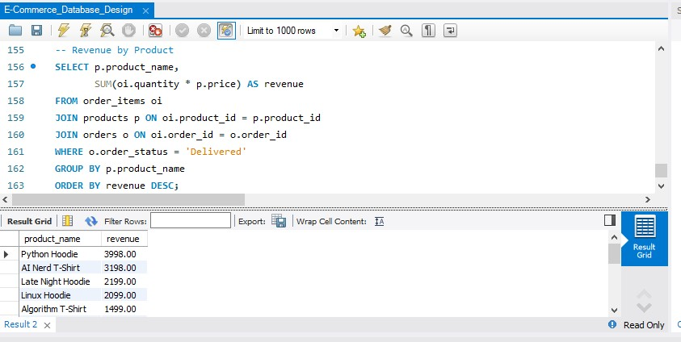
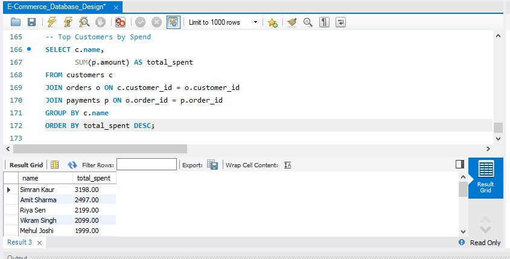
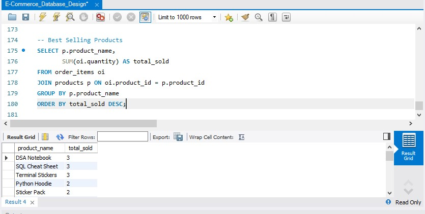

# E-Commerce-Database-SQL
SQL-based E-Commerce database analytics project using MySQL

# E-Commerce Database SQL Project

## Overview

A MySQL-based E-Commerce Database project designed to manage customers, products, orders, payments and sales analytics.

This project demonstrates relational database design and SQL analytics using real-world e-commerce business scenarios.

---

## Database Tables

### Customers
Stores customer information.

### Products
Stores product catalog details including product name, category and price.

### Orders
Stores customer order information.

### Order_Items
Stores products purchased in each order.

### Payments
Stores payment details and transaction information.

---

## SQL Concepts Used

- SELECT Statements
- WHERE Clause
- ORDER BY
- GROUP BY
- HAVING Clause
- INNER JOIN
- LEFT JOIN
- Aggregate Functions
- Subqueries
- Views

---

## Business Questions Solved

- Top revenue generating products
- Best selling products
- Highest spending customers
- Customer order analysis
- Product sales performance
- Revenue analysis by product
- Payment transaction analysis
- Order status insights

---

## Tools Used

- MySQL
- MySQL Workbench

---

## Project Structure

e_commerce_database.sql

Contains:

- Database Creation
- Table Creation
- Sample Data
- SQL Queries
- Analytical Queries
- Views

---

## Screenshots

### Top Revenue Products

### Highest Spending Customers

### Best Selling Products

